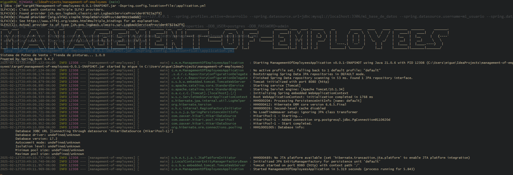
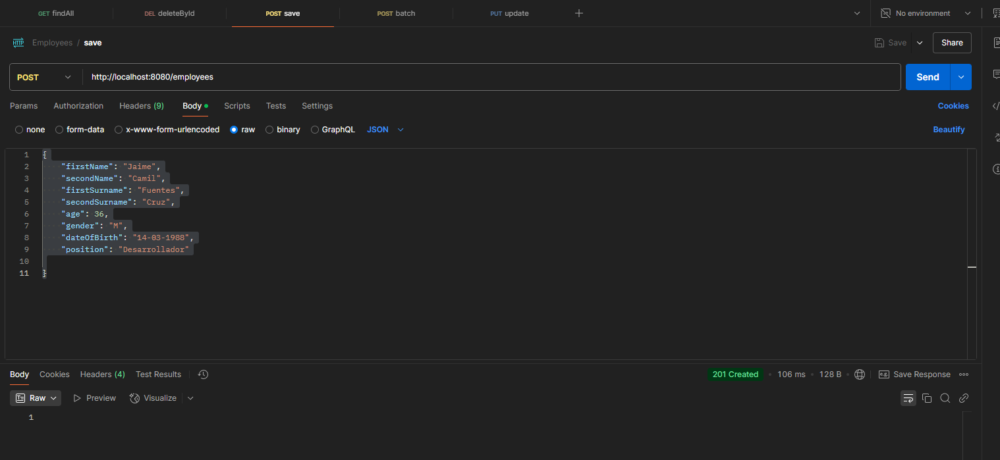

# Introducción

Prueba tecnica de Spring Boot, que consiste en crear un API REST para la gestion de empleados. El API debe permitir realizar operaciones CRUD en la entidad "Employee".
Esta prueba se ha realizado utilizando Spring Boot, Spring Data JPA y PostgreSQL como base de datos. 
El proyecto se encuentra en el siguiente repositorio de GitHub: [https://github.com/miguelalonsocoba/Prueba-SpringBoot](https://github.com/miguelalonsocoba/Prueba-SpringBoot)

## Tecnologías del proyecto con que se ha trabajado

- Git.
- Java 17.
- Maven 3.9.9
- PostgreSQL 17.
- Librerias utilizadas: 
    - Spring Boot.
    - Spring Data JPA.
    - Spring Web.
    - PostgreSQL.
    - OpenApi - Swagger.

## Construcción del proyecto

- Instalar [Java 17](https://www.oracle.com/java/technologies/downloads/?er=221886#java21) o superior.
- Clonar el repositorio de GitHub: [https://github.com/miguelalonsocoba/Prueba-SpringBoot](https://github.com/miguelalonsocoba/Prueba-SpringBoot).
- Descargar y configurar [PostgreSQL](https://www.postgresql.org/download/).
- Modificar el archivo "application.yaml" con configuraciones de la base de datos que se definieron previamente al instalar PostgreSQL.
    - Modificar DB_URL.
    - Modificar DB_USER.
    - Modificar DB_PASSWORD.
- Ejecutar el comando "mvn clean package" para construir el proyecto.
- Ejecutar el comando "mvn spring-boot:run -Dspring.config.location=file:\application.yml" para ejecutar el proyecto o ejecutarlo desde el IDE de su preferencia y agregar en el IDE el archivo "application.yaml" o agregar las variables de entorno que se encuentran en el archivo "application.yaml".
    - Opcional, si se ejecuta con el comando por consola "mvn spring-boot:run -Dspring.config.location=file:\application.yml", instalar [Maven 3.9.9](https://maven.apache.org/download.cgi) o superior.

## Ejecución del proyecto

- Instrucciones para ejecutar el proyecto:
    - Ejectuar comando "mvn clean package" para construir el proyecto.
    - Ejectuar comando "java -jar target/management-of-employees-0.0.1-SNAPSHOT.jar -Dspring.config.location=file:\application.yml" para ejecutar el proyecto.
    - Importar en Postman el archivo "Employees.postman_collection.json" para probar la API.
    - Opcional, se puede probar con [Swagger](http://localhost:8080/swagger-ui/index.html)

## Evidencia del servicio funcionando correctamente

- Se ejcuta comando en console "mvn clean package" para construir el proyecto.
  - 
  - 
- Se ejecuta comando "java -jar target/management-of-employees-0.0.1-SNAPSHOT.jar -Dspring.config.location=file:\application.yml" para ejecutar el proyecto.
  - 
- Se visualiza la documentación de la API en [Swagger](http://localhost:8080/swagger-ui/index.html).
  - 
- Se visualiza el consumo de la peticion findAll en Postman.
  - 
- Se consulta los registros en la base de datos.
  - 
- Se procede a insertar un nuevo Employee desde Postman.
  - 
- Se consulta los registros en la base de datos.
  - 

## Conclusión

El proyecto se ha realizado utilizando Spring Boot, Spring Data JPA y PostgreSQL como base de datos. 
El proyecto se encuentra en el siguiente repositorio de GitHub: [https://github.com/miguelalonsocoba/Prueba-SpringBoot](https://github.com/miguelalonsocoba/Prueba-SpringBoot).

